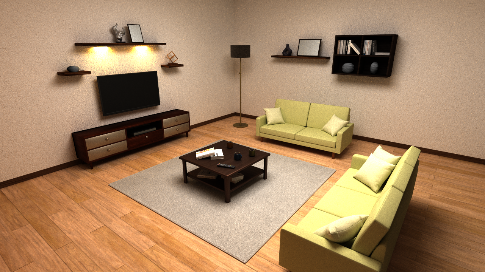

# rtcamp9
This repository contains the renderer submitted to [rtcamp9](https://sites.google.com/view/rtcamp9).

## Submission
[Video](video.mp4)
- Resolution: 1280x720
- Samples: 32
- FPS: 30
- Duration: 7s

## Build
Follow the [build instruction](https://github.com/ms-elk/alpine?tab=readme-ov-file#build) of `alpine`, but run CMake in the root directory of `rtcamp9` instead of `alpine`.
